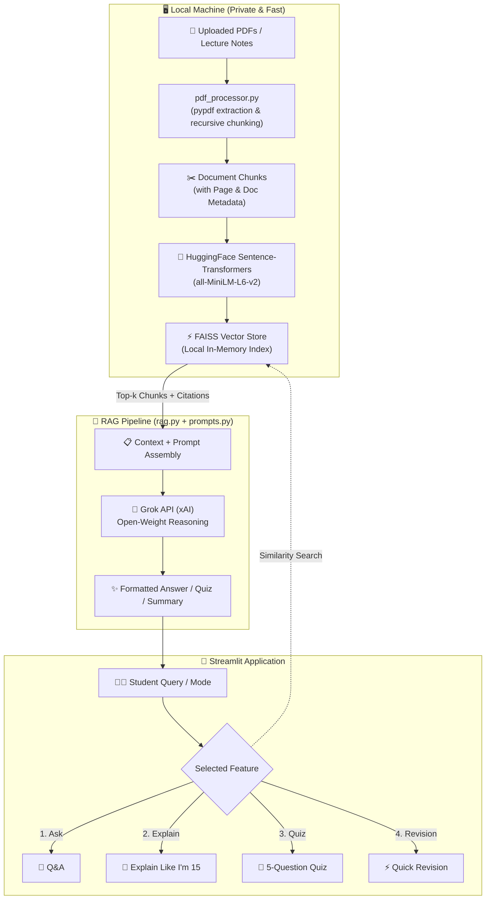

# 📚 StudyBuddy

> **Hacktoberfest Weekend Challenge: Build for a Friend**  
> *"Your personal study assistant, built for a friend."*

[](https://streamlit.io)
[](LICENSE)
[](https://hacktoberfest.com/)

---

## 💡 The Challenge Story

> *"My friend spends a lot of time going through lengthy lecture PDFs before exams. I wanted to build something small that could turn those notes into an interactive study assistant instead of making them search through hundreds of pages."*

College exams and certifications often come with hundreds of pages of dense slides, lecture handouts, and textbook chapters. Searching through dense PDFs under exam pressure is stressful and inefficient. 

**StudyBuddy** was created to solve this exact problem: an interactive, distraction-free study companion that ingests raw lecture notes, splits them into semantically meaningful chunks, and lets a student chat with their materials, get concepts explained like they are 15, generate practice recall quizzes, and produce 1-page rapid revision cram sheets.

---

## 🌟 Why Open Innovation & Open AI Matter

In traditional AI apps, entire documents are routinely uploaded to proprietary, closed-box cloud platforms where users have no visibility or control over data storage, retraining policies, or latency.

StudyBuddy is built around the ethos of **Open Innovation**:

1. **Local Privacy First**: Personal study materials and lecture notes are parsed and embedded locally on the student's machine using open HuggingFace `sentence-transformers` (`all-MiniLM-L6-v2`) and local FAISS vector search.
2. **No Closed-Box Document Dumps**: Unlike black-box AI platforms that ingest full private documents, only the specific semantic chunks relevant to a query are processed.
3. **Pluggable & Swappable Brain**: The LLM interface conforms to standard open conventions. You can run open-weight models via the Grok API, switch to local open-weights (like Llama 3, Mistral, or Gemma), or deploy on any open endpoint without rewriting application logic.
4. **Completely Controllable Pipeline**: You have 100% control over the chunking strategy (`chunk_size`, `chunk_overlap`), similarity search metrics, prompt templates, and scoring logic.
5. **Cost-Effective & Accessible**: Local vector search and embeddings cost $0.00 and run on standard CPU hardware without requiring dedicated GPU infrastructure.
6. **Open to Hack & Extend**: Designed with modular code (`pdf_processor.py`, `rag.py`, `prompts.py`, `app.py`) so any student can fork, adapt, and tailor it to their personal study habits.

### Calling an AI API vs. Building Around Open Components

| Feature | Generic Closed API Wrapper | StudyBuddy Open RAG Architecture |
| :--- | :--- | :--- |
| **Document Processing** | Sent entirely over the wire | Processed & parsed locally via `pypdf` |
| **Embeddings** | Proprietary paid cloud embeddings | Local HuggingFace `sentence-transformers` |
| **Vector Storage** | Vendor-locked cloud database | Local in-memory FAISS index |
| **Transparency** | Black box | Transparent retrieval with exact page citations |
| **Portability** | Trapped in single provider ecosystem | Modular, swappable, runs locally or on Streamlit Cloud |

---

## 🚀 Key Features

### 1. 📁 Multi-PDF Notes Ingestion
- Upload single or multiple PDF lecture slides, handouts, and notes.
- Extracts clean text while preserving original document filenames and page numbers.
- Handles empty or corrupt files with graceful user-facing notices.

### 2. 💬 Grounded Q&A ("Ask")
- Chat naturally with your study materials.
- Cites source document names and exact page numbers.
- Expandable context drawer displaying exact text chunks retrieved from your notes.

### 3. 🧠 "Explain Like I'm 15" (ELI15)
- Translates dense, intimidating academic jargon into clear, intuitive explanations.
- Generates relatable real-world analogies (e.g., explaining overfitting as memorizing test answers instead of learning concepts).
- Breaks ideas down step-by-step with exam tips.

### 4. 📝 Interactive 5-Question Quiz
- Synthesizes 5 high-yield multiple-choice questions (MCQs) directly from the notes.
- Interactive answering with automatic scoring, answer keys, and clear pedagogical explanations.

### 5. ⚡ Quick Revision Sheet
- One-click rapid cram sheet containing:
  - 📌 Core Concepts & Big Picture
  - 📖 Key Definitions
  - 📐 Important Formulas & Rules
  - ⚠️ Common Pitfalls & Traps to Avoid
  - 🎯 5 Must-Remember Points Before the Exam
- One-click Markdown export to save or print.

---

## 🏗️ Architecture



---

## 🛠️ Tech Stack

- **Frontend & App Framework**: [Streamlit](https://streamlit.io/)
- **RAG Pipeline & Orchestration**: [LangChain](https://www.langchain.com/) (`langchain-core`, `langchain-community`, `langchain-openai`)
- **LLM Reasoning**: [Grok API (xAI)](https://x.ai/) (`grok-beta`, `grok-2-latest`)
- **Local Embeddings**: [HuggingFace Sentence-Transformers](https://www.sbert.net/) (`all-MiniLM-L6-v2`)
- **Vector Search Engine**: [FAISS (faiss-cpu)](https://github.com/facebookresearch/faiss)
- **PDF Extraction**: [pypdf](https://pypdf.readthedocs.io/)

---

## 📂 Project Structure

```
studybuddy/
│
├── app.py              # Streamlit application UI, tabs & state management
├── rag.py              # RAG pipeline, local vector store & Grok LLM integration
├── pdf_processor.py    # Robust PDF extraction, cleaning, and text chunking
├── prompts.py          # Custom pedagogical prompt templates (QA, ELI15, Quiz, Revision)
├── requirements.txt    # Lean, pinned Python dependencies
├── .env.example        # Example environment configuration
├── .gitignore          # Git exclusion rules
└── README.md           # Documentation, challenge story & guides
```

---

## ⚙️ Local Setup Guide

Follow these steps to run StudyBuddy on your local machine:

### 1. Clone the Repository
```bash
git clone https://github.com/your-username/studybuddy.git
cd studybuddy
```

### 2. Create and Activate a Virtual Environment

**On Windows (PowerShell):**
```powershell
python -m venv venv
.\venv\Scripts\Activate.ps1
```

**On macOS / Linux:**
```bash
python3 -m venv venv
source venv/bin/activate
```

### 3. Install Requirements
```bash
pip install --upgrade pip
pip install -r requirements.txt
```

### 4. Configure Grok API Key
Create a `.env` file from `.env.example`:
```bash
cp .env.example .env
```
Open `.env` and paste your xAI Grok API key:
```env
GROK_API_KEY=xai-your-api-key-here
```
*(Alternatively, you can enter the API key directly into the sidebar in the running app!)*

### 5. Launch the Application
```bash
streamlit run app.py
```
StudyBuddy will open automatically in your browser at `http://localhost:8501`.

---

## ☁️ Streamlit Community Cloud Deployment

Deploying StudyBuddy to [Streamlit Community Cloud](https://share.streamlit.io/) is fast and simple:

1. Push your repository to GitHub (ensure `.env` is **not** committed).
2. Go to [share.streamlit.io](https://share.streamlit.io/) and click **"New app"**.
3. Select your repository, branch (`main`), and set the main file path to `app.py`.
4. In **Advanced Settings** > **Secrets**, add your Grok API key:
   ```toml
   GROK_API_KEY = "xai-your-api-key-here"
   ```
5. Click **Deploy!** Streamlit Cloud will install dependencies from `requirements.txt` and launch the app.

---

## 📸 Screenshots & Demo

| 💬 Interactive Q&A with Citations | 🧠 "Explain Like I'm 15" |
| :---: | :---: |
| *(Upload PDFs and get answers with document & page badges)* | *(Transforms complex topics with real-world analogies)* |

| 📝 Interactive 5-Question Quiz | ⚡ Rapid Exam Revision Cram Sheet |
| :---: | :---: |
| *(Test recall with immediate scoring and explanations)* | *(Summary, key definitions, formulas, and pitfalls)* |

---

## 🔮 Future Improvements

- [ ] Support for audio lecture transcripts (Whisper integration)
- [ ] Export flashcards directly to Anki (`.apkg`) format
- [ ] Diagram generation for visual learners
- [ ] Voice Q&A mode using WebRTC

---

## 📄 License

This project is licensed under the MIT License — see the [LICENSE](LICENSE) file for details. Built with ❤️ for the Hacktoberfest Weekend Challenge.
